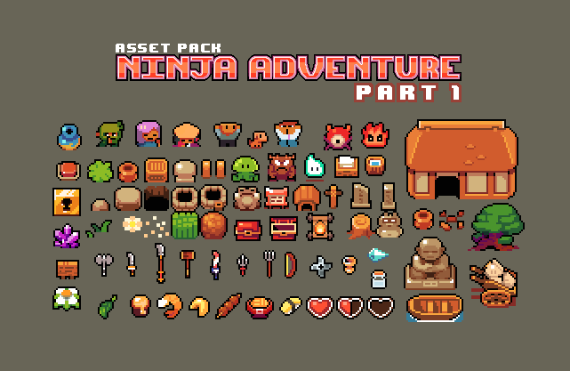
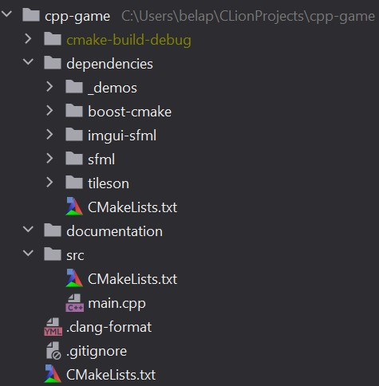

# General

## Adapted Goals
- Overworld with one section
- Characters without state (no memory of past conversations)
- Simple inventory management (Only one slot per category)
- Stats: No adaptive learning from combat, no damage-specific attacks for different enemies
- Simple saving in menu (No savepoints)
- No or only basic audio
- Only simple Main Menu

## Libraries
(So far)
- SFML: Graphics, input
- ImGui: UI
- Tiled / tileson: Create map
- spdlog: Logging
- Assets: Ninja adventure asset pack

## Steps overall (Assignments not final)
- Create, parse and display simple world (Daniela)
- Implement character movement, collisions, ... (Bela)
- Inventory management (Bela)
- NPCs (and enemies) (Daniela)
- Turn-based combat (?)
- Saving and loading (?)
- Final world with story (Both)

# Week 1

## Done
- Investigated libraries
- Built basic project/cmake structure, manage library imports
- Closer look at map parsing and rendering with Tiled/tileson/ImGui-sfml
- Create placeholder map with Tiled
- Planned future steps

## Next steps
- Create, parse and display simple world
- (Implement main character that can move around on map)

